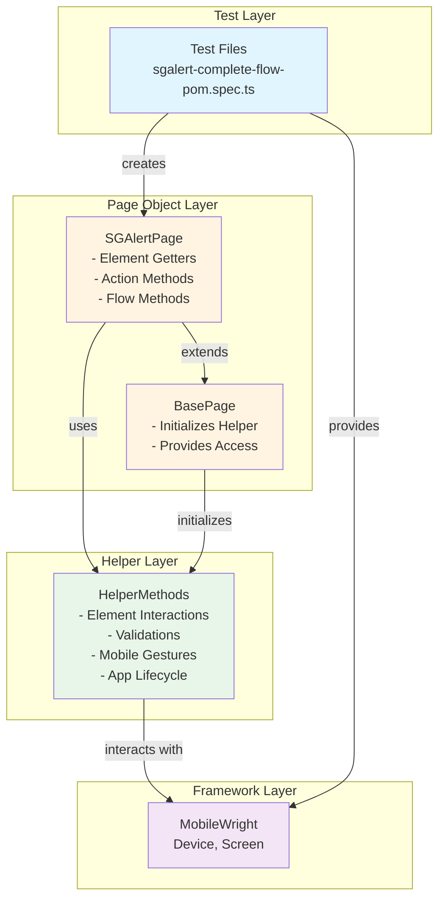
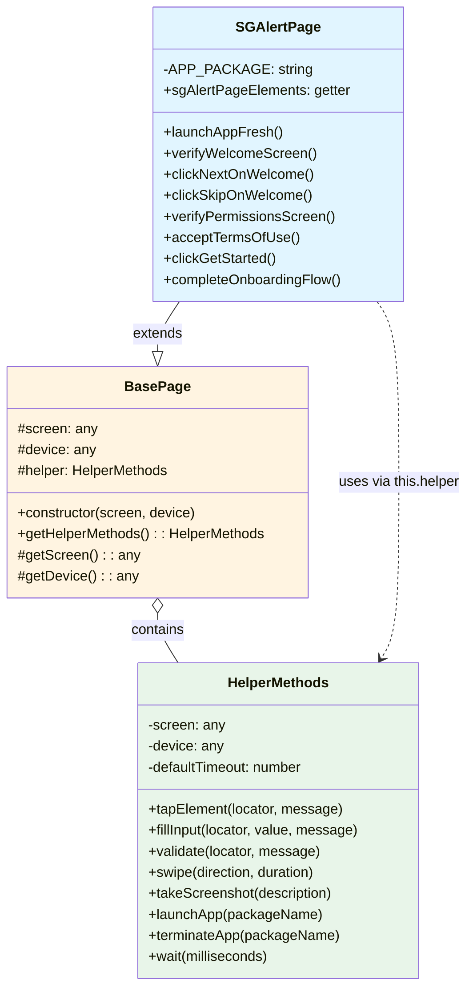
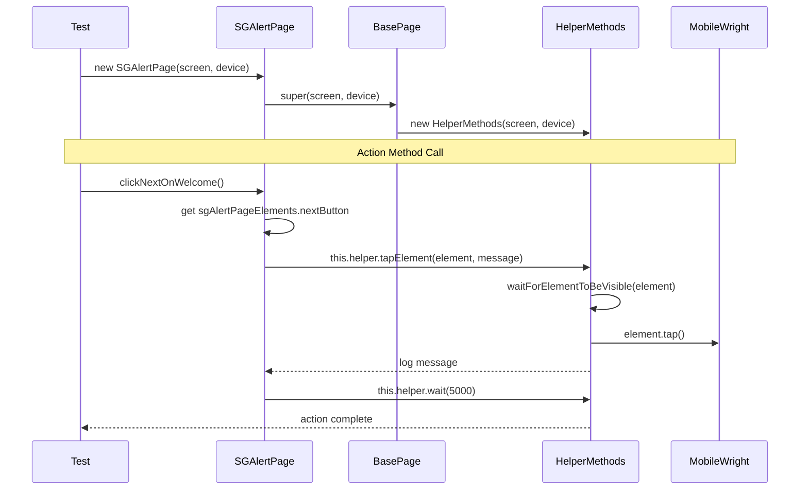
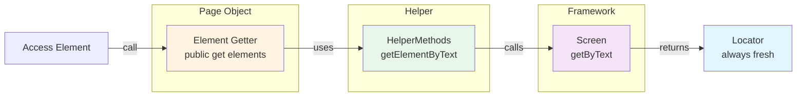
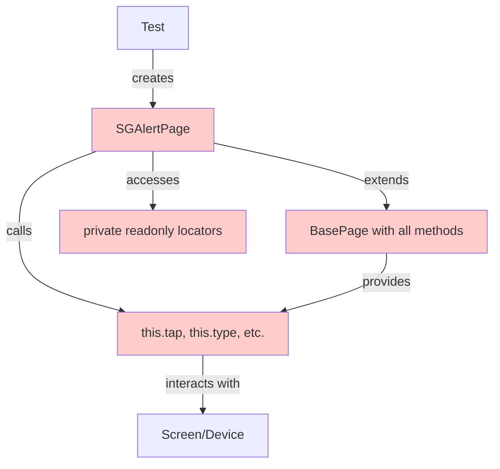
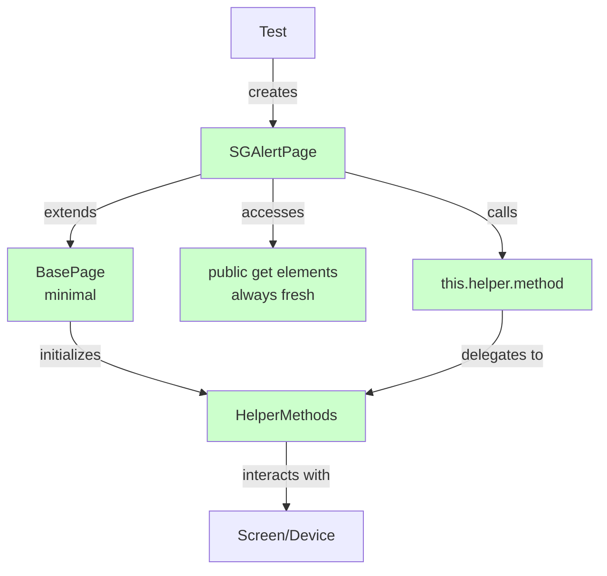
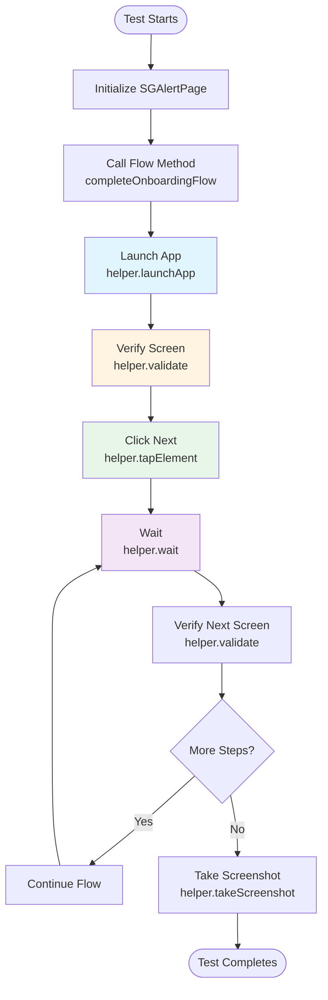
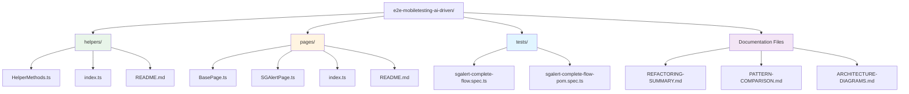
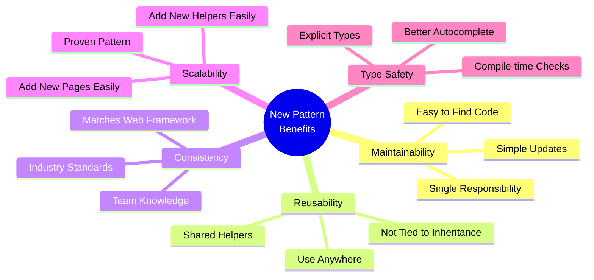
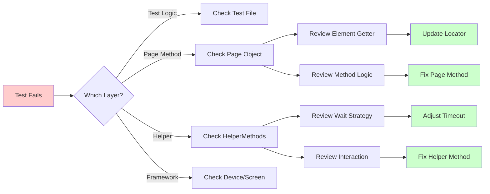

# Framework Architecture Diagrams

This document contains visual representations of the mobile testing framework architecture.

## 📐 Architecture Overview

## 🏗️ Class Relationships

## 🔄 Method Call Flow

## 📊 Element Getter Pattern

## 🎯 Pattern Comparison

### Old Pattern Flow

### New Pattern Flow

## 🚀 Test Execution Flow

## 📦 File Structure

## 💡 Benefits Visualization

## 🔍 Debugging Flow

---

## 📚 How to Read These Diagrams

1. **Architecture Overview**: Shows the layered structure of the framework
2. **Class Relationships**: Shows how classes relate (inheritance, composition, usage)
3. **Method Call Flow**: Shows the sequence of calls when executing a test
4. **Element Getter Pattern**: Shows how elements are accessed
5. **Pattern Comparison**: Visual comparison of old vs new approach
6. **Test Execution Flow**: Shows the flow during test execution
7. **File Structure**: Shows the organization of files and folders
8. **Benefits Visualization**: Mind map of pattern benefits
9. **Debugging Flow**: Decision tree for troubleshooting

## 🎨 Color Legend

- 🔵 Blue (`#e1f5ff`) - Test Layer
- 🟡 Yellow (`#fff4e1`) - Page Object Layer
- 🟢 Green (`#e8f5e9`) - Helper Layer
- 🟣 Purple (`#f3e5f5`) - Framework Layer
- 🔴 Red (`#ffcccc`) - Old Pattern
- ✅ Green (`#ccffcc`) - New Pattern

---

These diagrams provide a visual understanding of the framework architecture and how components interact with each other.
